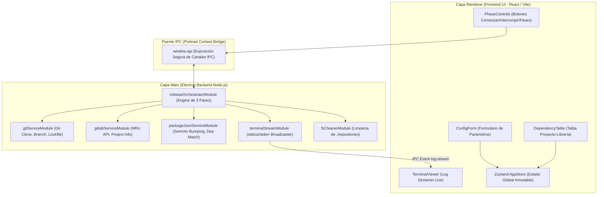
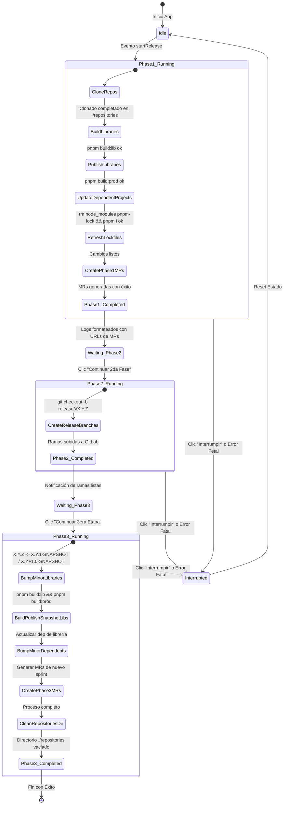

# 🏛️ Especificación de Arquitectura Técnica: Release Creator

> **Diseñado por**: Sheldon Cooper (Software & System Architect)  
> **Estado**: Aprobado por Lógica Superior Irrefutable  
> **Paradigma**: Funcional Puro (Sin `class` ni `this`), Screaming Architecture & Vertical Slicing.

---

## 1. Stack Tecnológico & Justificación Científica

| Capa | Tecnología | Justificación |
| :--- | :--- | :--- |
| **Runtime & Frame** | Electron + Node.js | Control directo de procesos del sistema (`child_process`), acceso filesystem local (`repositories/`) y sandbox IPC seguro. |
| **Bundler / Dev Engine** | Vite + React (TypeScript) | Compilación ultrarrápida, soporte nativo HMR y tipado estricto para prevenir estados inconsistentes. |
| **Estilos & UI** | CSS Modules + Vanilla CSS | Aislamiento estricto de estilos sin contaminación global ni sobrecarga de abstracciones innecesarias (Cero Tailwind). |
| **Estado Global** | Zustand (con `useShallow`) | Manejo de estado atómico e inmutable con selectores finos sin re-renders innecesarios. |
| **GitLab Integration** | Axios / `@gitbeaker/rest` | Cliente HTTP resiliente con manejo de tokens OAuth/PAT para instancias GitLab Enterprise personalizadas. |
| **Terminal Log Stream** | xterm.js / Log Buffer | Renderizado de logs ANSI de alta performance con auto-scroll y resaltado de sintaxis. |

---

## 2. Diagrama de Arquitectura del Sistema



---

## 3. Estructura de Módulos (Vertical Slicing & Programación Funcional Pura)

Prohibición absoluta del uso de `class`, `this` u Programación Orientada a Objetos. Todo el código de negocio se organiza en módulos funcionales expuestos mediante factories y funciones puras con **Result Pattern**.

```text
src/
├── main/
│   ├── index.ts                   # Entry point de Electron Main Process
│   ├── preload.ts                 # Preload script & IPC ContextBridge
│   └── modules/
│       ├── gitlab/                # Cliente API GitLab Enterprise
│       │   ├── gitlabService.ts
│       │   └── gitlabTypes.ts
│       ├── git/                   # Ejecución de comandos git (clone, checkout, push)
│       │   ├── gitService.ts
│       │   └── gitTypes.ts
│       ├── package/               # Manipulación de package.json & pnpm lockfile
│       │   ├── packageService.ts
│       │   └── packageTypes.ts
│       ├── releaseEngine/         # Motor de Orquestación de 3 Fases
│       │   ├── releaseOrchestrator.ts
│       │   ├── phase1Handler.ts
│       │   ├── phase2Handler.ts
│       │   ├── phase3Handler.ts
│       │   └── releaseTypes.ts
│       └── terminal/              # Broadcaster de logs en vivo
│           └── terminalStream.ts
├── renderer/
│   ├── App.tsx                    # Layout Principal
│   ├── modules/
│   │   ├── config/                # Módulo UI de Configuración & Inputs
│   │   │   ├── components/
│   │   │   └── configStore.ts
│   │   ├── terminal/              # Módulo UI de Terminal Output Live
│   │   │   ├── components/
│   │   │   └── terminalStore.ts
│   │   └── release/               # Módulo UI de Controles y Avance de Fases
│   │       ├── components/
│   │       └── releaseStore.ts
│   └── shared/
│       └── i18n/                  # Textos traducidos con claves t('key')
```

---

## 4. Patrón de Manejo de Errores: Result Pattern

Ninguna función de servicio lanzará excepciones (`throw`). Todas retornarás un tipo estricto `Result<T, E>`:

```typescript
export type Result<T, E = string> = 
  | { ok: true; value: T }
  | { ok: false; error: E };

export const createSuccess = <T>(value: T): Result<T, never> => ({
  ok: true,
  value
});

export const createFailure = <E = string>(error: E): Result<never, E> => ({
  ok: false,
  error
});
```

---

## 5. Máquina de Estados del Proceso de Release



---

## 6. Contrato IPC (Inter-Process Communication)

### Invocaciones Renderer ➔ Main (`ipcRenderer.invoke`)
1. `release:start`: Inicia la Fase 1 con el objeto `ReleaseConfig`.
2. `release:proceedPhase2`: Desencadena la ejecución de la Fase 2.
3. `release:proceedPhase3`: Desencadena la ejecución de la Fase 3.
4. `release:interrupt`: Detiene inmediatamente cualquier proceso en ejecución y mata child processes activos.

### Transmisión Main ➔ Renderer (`ipcRenderer.on`)
1. `terminal:log`: Evento emitido cada vez que se produce una línea de log (`{ stream: 'stdout' | 'stderr' | 'system', text: string, timestamp: number }`).
2. `release:statusChange`: Actualización del estado global de la fase (`{ currentPhase: 1 | 2 | 3, step: string, status: 'idle' | 'running' | 'waiting_user' | 'error' | 'success' }`).
3. `release:mrUrls`: Lista de URLs de MRs generadas (`{ phase: 1 | 3, mrList: Array<{ projectId: string, repoName: string, url: string }> }`).

---

## 7. Gestión del Sistema de Archivos Local (`./repositories`)

1. **Ubicación**: Todas las operaciones git ocurren dentro de `<root_proyecto>/repositories/`.
2. **Aislamiento**: Si la carpeta no existe, se crea programáticamente.
3. **Limpieza Post-Proceso**: Al finalizar con éxito la Fase 3 o al solicitar una interrupción limpia, un servicio dedicado (`fsCleanerModule`) remueve todo el contenido de `./repositories/*` para evitar espacio consumido residual.

---

## 8. Verificación de Conformidad Técnica

- [x] Programación Funcional Pura (Sin `class` ni `this`).
- [x] Screaming Architecture / Vertical Slicing en `src/modules/`.
- [x] Result Pattern estricto para manejo de errores.
- [x] Selectores Zustand inmutables con `useShallow`.
- [x] Estilos 100% aislados con CSS Modules.
- [x] Soporte i18n con claves `t('key')`.
- [x] Cumplimiento del flujo de 3 fases de Release y visualización de logs en vivo.
